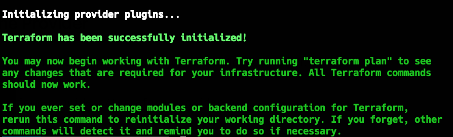
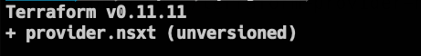

# terraform-nsxt

## Overview

This repo contains various Terraform templates for building out NSX-T logical conctructs such as routers, switches, loadbalancers, ip pools, and ip blocks.

**NOTE:** You must compile the NSX-T provider from source in order to use these templates. The majority of the resources listed above are not in the current 1.0 release of the provider.

## Compiling the provider from source

### Mac Instructions

1. Install Go (version **1.11+** is required) with Homebrew
    
    `brew install go`

2. Setup GOPATH

    ```
    $ mkdir ~/go
    $ export PATH=$PATH:$(go env GOPATH)/bin
    $ export GOPATH=$(go env GOPATH)
    $ echo $GOPATH
    /Users/nathan/go     //If everything is correct you should see this output
    ```

3. Now that Go is installed and our GOPATH is set, we can clone the project and compile the provider.

    - Clone the project

        `$ mkdir -p $GOPATH/src/github.com/terraform-providers`

        `$ cd $GOPATH/src/github.com/terraform-providers`

        `$ git clone git@github.com:terraform-providers/terraform-provider-nsxt`


    - Build the Provider

        `cd $GOPATH/src/github.com/terraform-providers/terraform-provider-nsxt`

        `go build`
        
        `ls -lrta`
        
        `terraform-provider-nsxt`   //If all goes well you should see the new complied provider in this folder

        - **Note:** If you get go `fmt` errors, they can be resolved by `gofmt -w ./nsxt/something.go` and then try `go build` again.

4. Now copy the file `terraform-provider-nsxt` into a new directory for your Terraform project.

    - Make a new directory for your terraform nsxt project
        
        `mkdir -p ~/repos/project1/.terraform/plugins/darwin_amd64/`
    - Copy the provider file into this directory

        `cp $GOPATH/src/github.com/terraform-providers/terraform-provider-nsxt/terraform-provider-nsxt ~/repos/project1/.terraform/plugins/darwin_amd64/terraform-provider-nsxt`

5. Go back to the parent directory of the project and initialize the provider and verify the installation of the provider.

    **NOTE:** This step requires the Terraform binary installed on your Mac. Easiest way is with `brew install terraform`.

    `cd ~/repos/project1/`

    `vi nsxt-topology.tf`

    ```
    provider "nsxt" {
    host                 = "192.168.64.20"
    username             = "admin"
    password             = "VMware1!"
    allow_unverified_ssl = "true"
    }
    ```

    `:wq!`

    `terraform init`
    
    
    `terraform version`
    

6. Happy Terraforming!