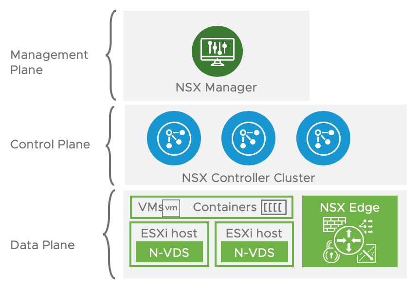

# NSX-T Terraform template for PKS Topologies

## Overview
PKS with NSX-T supports four different network architectures and deployment models. 

### It expects this:
* NSX Manager
* NSX Controllers
* NSX Edge Nodes
* NSX Edge Cluster
* vSphere Clusters Prepped

### Created by Terraform:
* 1 T0 Router
    * T0 Default Route
* NAT Rules for PKS MGMT
    * Opsman
    * BOSH
    * PKS Controller
    * Harbor
* 2 T1 Routers
    * 1 T1 PKS MGMT
    * 1 T1 PKS Data Services
* 2 Overlay Logical Switches
    * 1 T1 PKS MGMT
    * 1 T1 PKS Data Services
* 1 VLAN Logical Switch (Uplink for T0 Router)
* 2 IP Blocks
    * 1 IP Block for PKS Nodes
    * 1 IP Block for PKS Pods
* 1 IP Pool for VIPs 

### Create Manually
* T0 Uplink Ports
* HA VIP
* Static Route on the Physical Router for the IP Pool for VIPs

