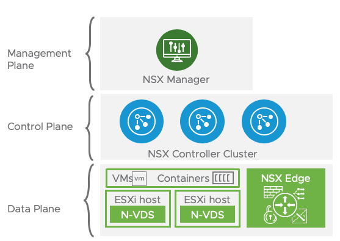

# Multi-T0 Topology ***Incomplete

## Overview

This topology is used for a Multi-tenant environment. 

**Note:** 
```

```


### Prerequisites prior to Terraform Provisioning:
* NSX Manager
* NSX Controllers
* NSX Edge Nodes
* NSX Edge Cluster
* vSphere Clusters Prepped



### Created by Terraform:
* 3 T0 Routers
    * Shared T0 Router
    * Customer A T0 Router
    * Customer B T0 Router
* 2 T1 Routers
    * 1 T1 PKS MGMT
    * 1 T1 PKS Data Services
* 3 Overlay Logical Switches
    * 1 T1 PKS MGMT
    * 1 T1 PKS Data Services
    * 1 T0 Intra Logical Switch
* 1 VLAN Logical Switch (Uplink for T0 Router)
* 2 IP Blocks
    * 1 IP Block for PKS Nodes
    * 1 IP Block for PKS Pods
* 1 IP Pool for VIPs 

### Created Manually
* T0 Uplink Ports

