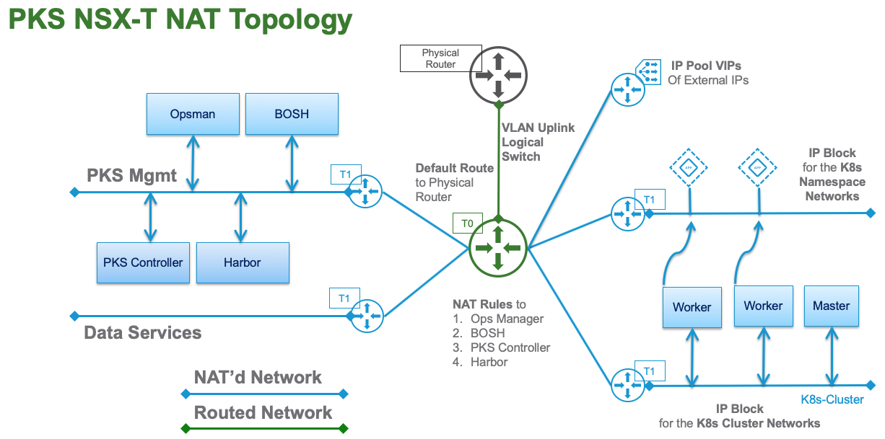

# PKS NAT Topology

## Overview

This topology uses NAT for all Management and Kubernetes cluster(s) logical networking. The PKS Mgmt components use DNAT rules created on the T0 to access the Private PKS Mgmt network. Kubernetes Clusters are accessed through the NSX Loadbalancer that is automatically instantiated at the time of cluster creation.

In this topology the Kubernetes Node networks are Private Networks that are allocated from the **IP Block** for the **K8s Cluster Networks**. This configuration is done by putting a checkmark in the **NAT mode** box in the PKS tile in Opsman.

### It expects this:
* NSX Manager
* NSX Controllers
* NSX Edge Nodes
* NSX Edge Cluster
* vSphere Clusters Prepped

### Created by Terraform:
* 1 T0 Router
    * T0 Default Route
* NAT Rules for PKS MGMT Private Network
    * Opsman
    * BOSH
    * PKS Controller
    * Harbor
* 2 T1 Routers
    * 1 T1 PKS MGMT
    * 1 T1 PKS Data Services
* 2 Overlay Logical Switches
    * 1 T1 PKS MGMT
    * 1 T1 PKS Data Services
* 1 VLAN Logical Switch (Uplink for T0 Router)
* 2 IP Blocks
    * 1 IP Block for PKS Nodes
    * 1 IP Block for PKS Pods
* 1 IP Pool for VIPs 

### Created Manually
* T0 Uplink Ports
* HA VIP
* Static Route on the Physical Router for the IP Pool for VIPs
