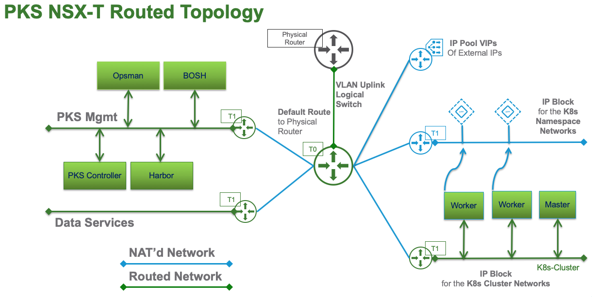

# PKS Routed Topology

## Overview

This topology uses corporately routeable networks for all PKS Management and Kubernetes cluster(s) logical networking. Access the PKS management components by the corporate IP Address on the routed "PKS MGMT" network. Kubernetes clusters are accessed through the NSX Loadbalancer that is automatically instantiated at the time of cluster creation. 

In this topology all Kubernetes Master(s) and Worker(s) nodes will be accessible by their corporate IP Address from the routeable **IP Block** for the **K8s Cluster Node Networks**. This configuration is done by removing the checkmark in the **NAT mode** box in the **Networking** section of the **PKS tile** in Opsman.

**Note:** The IP Pool, Node IP Block, and T1 Mgmt subnet **MUST** be owned by NSX and routeable throughout the physical network.
```
VIP_IP_POOL1_CIDR = "192.168.75.0/24"
NODE_IP_BLOCK_CIDR = "172.15.0.0/16"
T1_MGMT_IP_NET = "172.31.0.1/24"
T1_DATA_SVCS_IP_NET = "172.31.2.1/24" (Optional)
```



### It expects this:
* NSX Manager
* NSX Controllers
* NSX Edge Nodes
* NSX Edge Cluster
* vSphere Clusters Prepped


### Created by Terraform:
* 1 T0 Router
    * T0 Default Route
* 2 T1 Routers
    * 1 T1 PKS MGMT
    * 1 T1 PKS Data Services
* 2 Overlay Logical Switches
    * 1 T1 PKS MGMT
    * 1 T1 PKS Data Services
* 1 VLAN Logical Switch (Uplink for T0 Router)
* 2 IP Blocks
    * 1 IP Block for PKS Nodes
    * 1 IP Block for PKS Pods
* 1 IP Pool for VIPs 

### Created Manually
* T0 Uplink Ports
* HA VIP
* Static Route on the Physical Router for the IP Pool for VIPs
* Static Route on the Physical Router for the IP Block for Nodes
* Static Route on the Physical Router for the T1 Mgmt Subnet
* Static Route on the Physical Router for the T1 Data Services Subnet (Optional)
